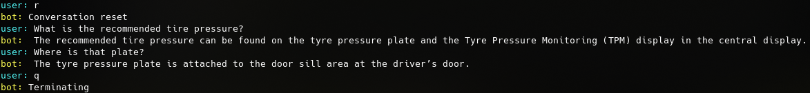

# Prototype of a GPT based QA system for interactive user manuals

## Usage

Setup python environment

    pip3 install langchain openai tiktoken faiss-cpu unstructured flask bardapi

Export OpenAI API key

    export OPENAI_API_KEY="your_api_key"

Pre-process source PDF

    python3 create_vector_store.py

Run demo app

    python3 app.py

### CLI Chat

    python3 chat_cli.py

control strings:

- "h" - show current chat history
- "s" - remove latest question from chat history
- "r" - reset chat history
- "q" - exit



## Bard, fasttext and Llama (separate folders)

### FastText embeddings
To use fasttext embeddings in **fasttext_embs** folder:
```
git clone https://github.com/facebookresearch/fastText.git
cd fastText
sudo pip install .
# or with:
sudo python setup.py install
```

### Bard chat

Follow the README at https://github.com/dsdanielpark/Bard-API to use **Bard** in **/bard** folder (RetrievalQA). After you get the __Secure-1PSID value from your browser, do:
```
export _BARD_API_KEY="your__Secure-1PSID_value"
```

### Llama
[Gathered knowledge so far](llama/LLAMA2_KNOWLEDGE.md)
